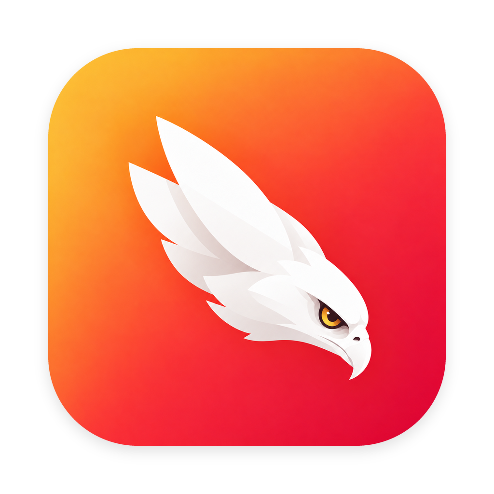

# Hawky

<p align="center">
  
</p>

<p align="center">
  <strong>A macOS menu bar app that tells you when Claude Code is waiting for permission — and takes you there.</strong>
</p>

<p align="center">
  <a href="https://hawky.kkweb.io">Website</a> ·
  <a href="https://github.com/piro0919/hawky/releases/latest">Download</a> ·
  <a href="https://buymeacoffee.com/piro0919">Buy Me a Coffee</a>
</p>

---

## Why Hawky

I run Claude Code in several repositories at once, one Cursor window each. Sooner or later one of them stops to ask "may I run this?" — and sits there, silently, while I'm looking at another window. I'd find out ten minutes later.

Hawky watches every session from the menu bar. When one is waiting, the count shows up next to the hawk. Pick it from the list and Hawky brings that Cursor window to the front, even when the window is tucked behind others as a macOS tab.

## Features

- A count in the menu bar of Claude Code sessions waiting for permission
- One click to bring the waiting session's Cursor window to the front
- Finds the window by the session's own title, so two windows on the same repository are told apart
- Works with Cursor windows merged into macOS tabs (`window.nativeTabs`)
- Clears itself as soon as the session moves on — approve, deny, or type a new prompt
- Stale entries expire after 10 minutes, so the count never gets stuck
- English / Japanese, picked from your system language
- Menu bar only — no Dock icon, no window

## Requirements

- macOS 14 Sonoma or later
- [Claude Code](https://claude.com/claude-code) running in [Cursor](https://cursor.com) (the extension or the terminal inside it)
- Node.js on your `PATH` — the Claude Code hooks are small Node scripts
- Accessibility permission, to bring windows to the front

## Install

With Homebrew:

```sh
brew install --cask piro0919/tap/hawky
```

Or download `Hawky-x.y.z.zip` from the [latest release](https://github.com/piro0919/hawky/releases/latest), unzip it and move `Hawky.app` to `/Applications`.

Hawky is not notarized. The first time, right-click `Hawky.app` and choose **Open**, or run:

```sh
xattr -dr com.apple.quarantine /Applications/Hawky.app
```

Then register the Claude Code hooks. They go into `~/.claude/settings.json`; hooks you already have are left alone.

```sh
node /Applications/Hawky.app/Contents/Resources/hook/install.mjs
```

Open Hawky and grant Accessibility access when macOS asks.

To remove the hooks later:

```sh
node /Applications/Hawky.app/Contents/Resources/hook/install.mjs --remove
```

## How it works

Claude Code fires a `Notification` hook with `permission_prompt` when it stops to ask. Hawky's hook writes one small file per waiting session to `~/.claude/hawky/pending/`, including the session's title from its transcript. `PostToolUse`, `UserPromptSubmit` and `Stop` remove it again.

The app watches that folder. When you pick an entry, it looks for the Cursor window whose title starts with the session's title, then for a macOS tab with that title, then for a Cursor tab inside the windows of that repository, and finally for any window of that repository.

## Build from source

```sh
python3 scripts/build-icons.py   # only when assets/icon-source.png changes
./build.sh                       # builds Hawky.app
node hook/install.mjs
open ./Hawky.app
```

No Xcode project — `build.sh` calls `swiftc` directly.

## License

MIT
